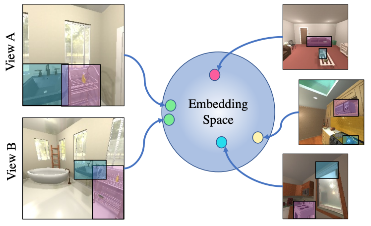

# Continuous Scene Representations for Embodied AI


This repo implements [Continuous Scene Representations for Embodied AI](TODO) by Samir Gadre, Kiana Ehsani, Shuran Song, and Roozbeh Mottaghi.

## Abstract:

We propose Continuous Scene Representations (CSR), a scene representation constructed by an embodied agent navigating within a space, where objects and their relationships are modeled by continuous valued embeddings. Our method captures feature relationships between objects, composes them into a graph structure on-the-fly, and situates an embodied agent within the representation. Our key insight is to embed pair-wise relationships between objects in a latent space. This allows for a richer representation compared to discrete relations (e.g., \[support\], \[next-to\]) commonly used for building scene representations. Our CSR can track objects as the agent moves in a scene, update the representation accordingly, and detect changes in room configurations. Using CSR we outperform state-of-the-art approaches for the challenging downstream task of visual room rearrangement, without any task specific training. Moreover, we show the learned embeddings capture salient spatial details of the scene and show applicability to real world data.

## Code

### Installation
Use conda to install most dependencies:
```
conda env create --file environment.yml --name csr
```

Our repo additionally depends on [Detectron2](https://detectron2.readthedocs.io/en/latest/tutorials/install.html#build-detectron2-from-source). We recommend following the "Build Detectron2 from Source" instructions.


### Data and Checkpoints
Datasets can be downloaded from [here](TODO).
Checkpoints can be downloaded from [here](TODO).
Make sure to extract in the root folder `/csr`

### Training node and edge representations
We provide a checkpoint for at: `checkpoints/csr_scene.ckpt`.
However, to train a continuous scene representation (CSR) from scratch, run the following:
```
python train_csr.py --conf configs_constrastive/moco_v2_scene.yml
```

Note, `moco_v2_scene.yml` assumes an 8-gpu machine. To train with a different number of gpus, change the `gpus` field in `moco_v2_scene.yml`.

### Training object correspondence representations
We provide a checkpoint at `checkpoints/csr_object.ckpt`.
To train a model to match objects between trajectories from scratch, run the following:
```
python train_csr.py --conf configs_constrastive/moco_v2_object.yml
```

Note, `moco_v2_object.yml` assumes an 8-gpu machine. To train with a different number of gpus, change the `gpus` field in `moco_v2_object.yml`.

### Caching exploration trajectories
We provide pre-cached trajectories in `explore_cache_test` and `explore_cache_val` for the test and val RoomR datasets.
To cache val and test trajectories yourself, run the following:
```
python runner_cache_trajectories.py --config-dir-path configs_exploration
```

### Evaluation on Visual Room Rearrangement (RoomR)
To run rearrangment on the RoomR test and val datasets, run the following:
```
python runner_eval_rearrangement.py
```

### Get RoomR results
To tabulate results on RoomR, run the following:
```
python aggrigate_metrics.py
```
Note: this command can be run during evaluation to get the current evaluation numbers. There are a total of 1000 test episodes and 1000 val episodes.

Using the provided checkpoints and cached trajectories results should be close to those presented in the following table for the test set:
| Model | % Fixed Strict | % Success |
|------------|:----------:|:----------:|
| CSR Full | 1.9 | 0.4 |


### Citation
If you found this repository useful, please consider citing:

```bibtex
@article{gadre2022csr,
  title={Continuous Scene Representations for Embodied AI},
  author={Gadre, Samir and Ehsani, Kiana and Song, Shuran and Mottaghi, Roozbeh},
  journal={CVPR},
  year={2022}
}
```